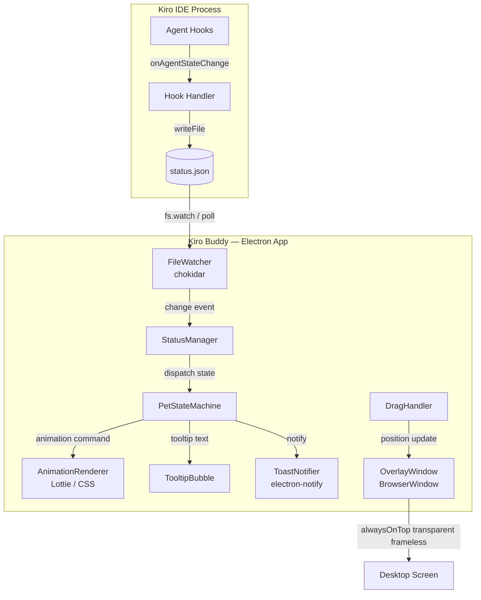
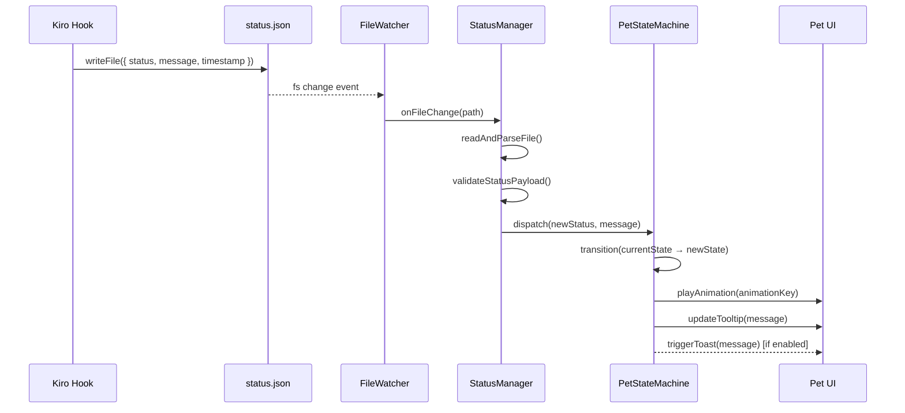
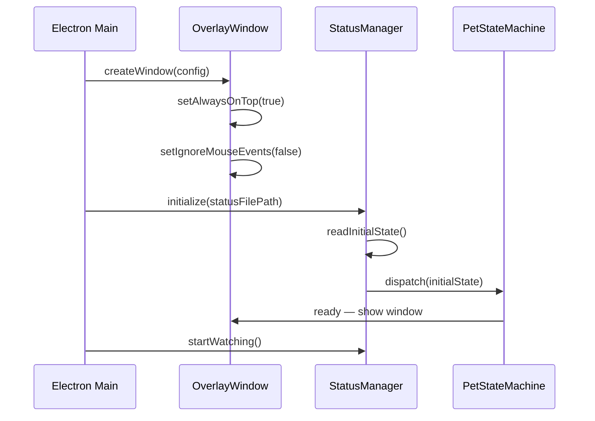
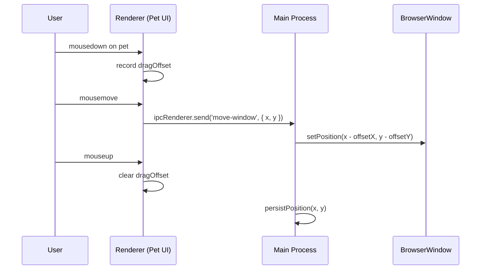
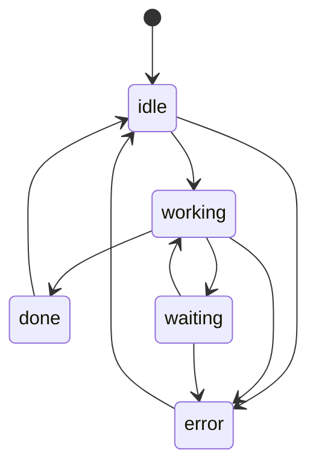

# Design Document: Kiro Buddy

## Overview

Kiro Buddy is a floating desktop pet overlay that provides always-visible, real-time visual feedback of Kiro agent activity. It runs as a lightweight Electron application that stays on top of all other windows, displaying an animated character whose state reflects what Kiro is currently doing — idle, working, waiting for input, completed, or errored — so users can monitor AI progress without switching tabs.

The system uses a file-based status channel: Kiro hooks write a `status.json` file whenever agent state changes, and the Electron overlay polls or watches that file to update the pet's animation and tooltip in real time. This decoupled architecture keeps the overlay independent of Kiro's internal process and avoids tight coupling to any specific Kiro API version.

The MVP targets three core states (idle, working, done), a single pet character with five animation states, a draggable frameless transparent window, and optional toast notifications on task completion or error.

---

## Architecture



### Key Architectural Decisions

| Decision | Choice | Rationale |
|---|---|---|
| Desktop framework | Electron | Fastest to build, broad OS support, rich Node.js ecosystem |
| Status channel | File-based (`status.json`) | Simple, no IPC setup, works across processes, easy to debug |
| File watching | `chokidar` | Cross-platform, handles edge cases better than raw `fs.watch` |
| Animations | Lottie (JSON) + CSS fallback | Smooth, lightweight, designer-friendly; CSS fallback for simple states |
| Window type | Frameless + transparent + alwaysOnTop | Non-intrusive overlay behavior |
| State management | Finite state machine | Prevents invalid state transitions, easy to extend |

---

## Sequence Diagrams

### State Update Flow



### Startup Flow



### Drag Interaction Flow



---

## Components and Interfaces

### Component 1: OverlayWindow

**Purpose**: Creates and manages the Electron `BrowserWindow` with overlay properties.

**Interface**:
```typescript
interface OverlayWindowConfig {
  width: number           // default: 120
  height: number          // default: 120
  x: number               // last saved x position
  y: number               // last saved y position
  alwaysOnTop: boolean    // default: true
  transparent: boolean    // default: true
  frame: boolean          // default: false
  skipTaskbar: boolean    // default: true
}

interface OverlayWindow {
  create(config: OverlayWindowConfig): BrowserWindow
  setPosition(x: number, y: number): void
  setClickThrough(enabled: boolean): void
  show(): void
  hide(): void
}
```

**Responsibilities**:
- Create frameless, transparent, always-on-top BrowserWindow
- Persist and restore window position across sessions
- Toggle click-through mode via `setIgnoreMouseEvents()`
- Handle window lifecycle (show/hide/close)

---

### Component 2: StatusManager

**Purpose**: Reads and watches `status.json`, validates payloads, and dispatches state changes.

**Interface**:
```typescript
type AgentStatus = 'idle' | 'working' | 'waiting' | 'done' | 'error'

interface StatusPayload {
  status: AgentStatus
  message: string         // e.g. "Implementing feature…"
  timestamp: number       // Unix ms
}

interface StatusManager {
  initialize(filePath: string): Promise<void>
  startWatching(): void
  stopWatching(): void
  onStatusChange(callback: (payload: StatusPayload) => void): void
  getCurrentStatus(): StatusPayload | null
}
```

**Responsibilities**:
- Watch `status.json` for changes using `chokidar`
- Parse and validate incoming JSON payloads
- Debounce rapid file changes (50ms window)
- Emit status change events to subscribers
- Handle missing or malformed file gracefully (fall back to `idle`)

---

### Component 3: PetStateMachine

**Purpose**: Manages valid state transitions and coordinates UI updates.

**Interface**:
```typescript
type PetState = 'idle' | 'working' | 'waiting' | 'done' | 'error'

interface StateTransition {
  from: PetState | '*'    // '*' = any state
  to: PetState
  action: () => void
}

interface PetStateMachine {
  dispatch(newState: PetState, message: string): void
  getCurrentState(): PetState
  onTransition(callback: (from: PetState, to: PetState) => void): void
}
```

**Valid Transitions**:



**Responsibilities**:
- Enforce valid state transitions (reject invalid ones with a warning)
- Trigger animation changes on transition
- Trigger tooltip updates on transition
- Fire toast notifications for `done` and `error` transitions (if enabled)

---

### Component 4: AnimationRenderer

**Purpose**: Plays the correct animation for each pet state.

**Interface**:
```typescript
type AnimationKey = 'breathe' | 'typing' | 'confused' | 'bounce' | 'shake'

interface AnimationConfig {
  key: AnimationKey
  loop: boolean
  speed: number           // 1.0 = normal
}

interface AnimationRenderer {
  play(config: AnimationConfig): void
  stop(): void
  getCurrentAnimation(): AnimationKey | null
}
```

**State → Animation Mapping**:

| Pet State | Animation Key | Loop | Description |
|---|---|---|---|
| `idle` | `breathe` | true | Slow scale pulse |
| `working` | `typing` | true | Rapid movement / sparks |
| `waiting` | `confused` | true | Head tilt / question mark |
| `done` | `bounce` | false (×3) | Happy jump |
| `error` | `shake` | false (×2) | Horizontal shake |

**Responsibilities**:
- Load Lottie JSON animation files from `assets/animations/`
- Play, loop, and stop animations on demand
- Fall back to CSS keyframe animations if Lottie fails to load

---

### Component 5: TooltipBubble

**Purpose**: Displays a short status message above the pet character.

**Interface**:
```typescript
interface TooltipBubble {
  show(message: string): void
  hide(): void
  update(message: string): void
  setAutoHide(durationMs: number): void
}
```

**Responsibilities**:
- Render speech-bubble-style overlay above the pet
- Auto-hide after configurable duration (default: 4000ms) for `done`/`error`
- Persist tooltip while `working` or `waiting`
- Truncate messages longer than 60 characters with ellipsis

---

### Component 6: ToastNotifier

**Purpose**: Fires OS-level toast notifications for terminal state changes.

**Interface**:
```typescript
interface NotificationConfig {
  enabled: boolean
  onDone: boolean
  onError: boolean
}

interface ToastNotifier {
  configure(config: NotificationConfig): void
  notify(title: string, body: string): void
}
```

**Responsibilities**:
- Use Electron's `Notification` API for OS-native toasts
- Only fire when the overlay window is not focused (avoid double feedback)
- Respect user's enabled/disabled preference stored in config

---

### Component 7: DragHandler

**Purpose**: Enables the user to drag the pet to any screen position.

**Interface**:
```typescript
interface DragHandler {
  attach(element: HTMLElement): void
  detach(): void
  onPositionChange(callback: (x: number, y: number) => void): void
}
```

**Responsibilities**:
- Track `mousedown`, `mousemove`, `mouseup` on the pet element
- Send window position updates to main process via IPC
- Persist final position to `config.json` on `mouseup`

---

## Data Models

### StatusPayload

```typescript
interface StatusPayload {
  status: 'idle' | 'working' | 'waiting' | 'done' | 'error'
  message: string     // Human-readable description, max 120 chars
  timestamp: number   // Unix epoch milliseconds
}
```

**Validation Rules**:
- `status` must be one of the five enum values
- `message` must be a non-empty string, max 120 characters
- `timestamp` must be a positive integer
- Entire payload must be valid JSON
- File must be UTF-8 encoded

**Example**:
```json
{
  "status": "working",
  "message": "Implementing feature: kiro-buddy overlay",
  "timestamp": 1718000000000
}
```

---

### AppConfig

```typescript
interface AppConfig {
  window: {
    x: number           // Last known x position, default: 100
    y: number           // Last known y position, default: 100
    width: number       // Fixed: 120
    height: number      // Fixed: 120
  }
  statusFilePath: string  // Absolute path to status.json
  notifications: {
    enabled: boolean    // default: true
    onDone: boolean     // default: true
    onError: boolean    // default: true
  }
  clickThrough: boolean   // default: false
  pollIntervalMs: number  // Fallback poll interval, default: 500
}
```

**Storage**: `~/.kiro-buddy/config.json`

---

## Algorithmic Pseudocode

### Main Status Processing Algorithm

```pascal
ALGORITHM processStatusUpdate(filePath)
INPUT: filePath — absolute path to status.json
OUTPUT: void (side effects: state transition, UI update)

BEGIN
  // Read file with error handling
  TRY
    rawContent ← fs.readFileSync(filePath, 'utf-8')
  CATCH ioError
    LOG "Failed to read status file: " + ioError.message
    RETURN
  END TRY

  // Parse JSON
  TRY
    payload ← JSON.parse(rawContent)
  CATCH parseError
    LOG "Malformed status.json — ignoring update"
    RETURN
  END TRY

  // Validate payload
  IF NOT validateStatusPayload(payload) THEN
    LOG "Invalid payload schema — ignoring update"
    RETURN
  END IF

  // Debounce: skip if same state and recent timestamp
  lastPayload ← statusManager.getCurrentStatus()
  IF lastPayload IS NOT NULL
    AND payload.status EQUALS lastPayload.status
    AND (payload.timestamp - lastPayload.timestamp) < DEBOUNCE_MS THEN
    RETURN
  END IF

  // Dispatch to state machine
  petStateMachine.dispatch(payload.status, payload.message)
END
```

**Preconditions**:
- `filePath` is a valid absolute path string
- File system is accessible

**Postconditions**:
- If file is valid: pet state is updated to match `payload.status`
- If file is invalid: pet state is unchanged, error is logged
- No exceptions propagate to caller

**Loop Invariants**: N/A (no loops in this algorithm)

---

### State Transition Algorithm

```pascal
ALGORITHM dispatch(newState, message)
INPUT: newState — target PetState, message — tooltip string
OUTPUT: void (side effects: animation change, tooltip update, optional toast)

PRECONDITION: newState ∈ { idle, working, waiting, done, error }

BEGIN
  currentState ← stateMachine.current

  // Validate transition
  IF NOT isValidTransition(currentState, newState) THEN
    LOG "Invalid transition: " + currentState + " → " + newState
    RETURN
  END IF

  // Update state
  previousState ← currentState
  stateMachine.current ← newState

  // Trigger animation
  animKey ← STATE_TO_ANIMATION_MAP[newState]
  animationRenderer.play({ key: animKey, loop: shouldLoop(newState) })

  // Update tooltip
  IF message IS NOT EMPTY THEN
    tooltipBubble.show(message)
    IF newState IN { done, error } THEN
      tooltipBubble.setAutoHide(AUTO_HIDE_MS)
    END IF
  ELSE
    tooltipBubble.hide()
  END IF

  // Fire toast notification for terminal states
  IF newState IN { done, error } AND toastNotifier.isEnabled() THEN
    toastNotifier.notify(STATE_TITLES[newState], message)
  END IF

  // Notify transition listeners
  FOR each listener IN transitionListeners DO
    listener(previousState, newState)
  END FOR
END
```

**Preconditions**:
- `newState` is a valid `PetState` value
- `animationRenderer`, `tooltipBubble`, `toastNotifier` are initialized

**Postconditions**:
- `stateMachine.current` equals `newState`
- Animation matching `newState` is playing
- Tooltip reflects `message` (or is hidden if empty)
- Toast fired iff `newState ∈ {done, error}` and notifications enabled

**Loop Invariants**:
- All listeners invoked before loop exits have received `(previousState, newState)`

---

### Validation Algorithm

```pascal
ALGORITHM validateStatusPayload(payload)
INPUT: payload — parsed JSON object (any)
OUTPUT: isValid — boolean

BEGIN
  VALID_STATUSES ← { 'idle', 'working', 'waiting', 'done', 'error' }

  IF payload IS NULL OR typeof payload ≠ 'object' THEN
    RETURN false
  END IF

  IF typeof payload.status ≠ 'string' THEN
    RETURN false
  END IF

  IF payload.status NOT IN VALID_STATUSES THEN
    RETURN false
  END IF

  IF typeof payload.message ≠ 'string' THEN
    RETURN false
  END IF

  IF payload.message.length = 0 OR payload.message.length > 120 THEN
    RETURN false
  END IF

  IF typeof payload.timestamp ≠ 'number' THEN
    RETURN false
  END IF

  IF payload.timestamp ≤ 0 OR NOT Number.isInteger(payload.timestamp) THEN
    RETURN false
  END IF

  RETURN true
END
```

**Preconditions**:
- `payload` is the result of `JSON.parse()` (may be any type)

**Postconditions**:
- Returns `true` iff payload matches `StatusPayload` schema exactly
- No mutations to `payload`
- No exceptions thrown

---

### File Watcher Initialization Algorithm

```pascal
ALGORITHM initializeWatcher(filePath, onChangeCb)
INPUT: filePath — path to status.json, onChangeCb — callback function
OUTPUT: watcher — chokidar FSWatcher instance

BEGIN
  // Ensure directory exists
  dir ← path.dirname(filePath)
  IF NOT fs.existsSync(dir) THEN
    fs.mkdirSync(dir, { recursive: true })
  END IF

  // Create placeholder file if missing
  IF NOT fs.existsSync(filePath) THEN
    defaultPayload ← { status: 'idle', message: 'Kiro is ready', timestamp: Date.now() }
    fs.writeFileSync(filePath, JSON.stringify(defaultPayload))
  END IF

  // Initialize chokidar watcher
  watcher ← chokidar.watch(filePath, {
    persistent: true,
    ignoreInitial: false,
    awaitWriteFinish: { stabilityThreshold: 50, pollInterval: 10 }
  })

  watcher.on('change', (path) → onChangeCb(path))
  watcher.on('add',    (path) → onChangeCb(path))
  watcher.on('error',  (err)  → LOG "Watcher error: " + err.message)

  RETURN watcher
END
```

**Preconditions**:
- `filePath` is a valid absolute path
- `onChangeCb` is a callable function

**Postconditions**:
- Watcher is active and listening for changes to `filePath`
- `status.json` exists at `filePath` (created with defaults if absent)
- Returns a valid watcher instance that can be `.close()`d

---

### Drag Position Algorithm

```pascal
ALGORITHM handleDrag(mouseEvent, windowBounds, screenBounds)
INPUT: mouseEvent — { type, clientX, clientY }, windowBounds — { x, y, w, h }, screenBounds — { width, height }
OUTPUT: newPosition — { x, y } or null (if not dragging)

PERSISTENT STATE: dragOffset — { x, y } | null

BEGIN
  IF mouseEvent.type = 'mousedown' THEN
    dragOffset ← { x: mouseEvent.clientX, y: mouseEvent.clientY }
    RETURN null
  END IF

  IF mouseEvent.type = 'mouseup' THEN
    dragOffset ← null
    persistPosition(windowBounds.x, windowBounds.y)
    RETURN null
  END IF

  IF mouseEvent.type = 'mousemove' AND dragOffset IS NOT NULL THEN
    rawX ← windowBounds.x + (mouseEvent.clientX - dragOffset.x)
    rawY ← windowBounds.y + (mouseEvent.clientY - dragOffset.y)

    // Clamp to screen bounds
    clampedX ← MAX(0, MIN(rawX, screenBounds.width  - windowBounds.w))
    clampedY ← MAX(0, MIN(rawY, screenBounds.height - windowBounds.h))

    RETURN { x: clampedX, y: clampedY }
  END IF

  RETURN null
END
```

**Preconditions**:
- `mouseEvent.type` ∈ `{ mousedown, mousemove, mouseup }`
- `screenBounds.width > windowBounds.w` and `screenBounds.height > windowBounds.h`

**Postconditions**:
- On `mousedown`: drag tracking begins, returns null
- On `mousemove` while dragging: returns clamped position within screen bounds
- On `mouseup`: drag tracking ends, position persisted, returns null
- Returned position (when non-null) satisfies: `0 ≤ x ≤ screenBounds.width - w` and `0 ≤ y ≤ screenBounds.height - h`

**Loop Invariants**: N/A

---

## Key Functions with Formal Specifications

### `createOverlayWindow(config)`

```typescript
function createOverlayWindow(config: OverlayWindowConfig): BrowserWindow
```

**Preconditions**:
- `config.width > 0` and `config.height > 0`
- `config.x` and `config.y` are within current display bounds
- Electron `app` is ready

**Postconditions**:
- Returns a `BrowserWindow` with `alwaysOnTop === true`
- Window is frameless and transparent
- Window is positioned at `(config.x, config.y)`
- `skipTaskbar === true` (not shown in OS taskbar)

---

### `StatusManager.initialize(filePath)`

```typescript
async function initialize(filePath: string): Promise<void>
```

**Preconditions**:
- `filePath` is a non-empty absolute path string
- Application has read/write access to the file's parent directory

**Postconditions**:
- File watcher is active on `filePath`
- If file exists: initial state is read and dispatched
- If file missing: created with `idle` defaults, `idle` state dispatched
- `getCurrentStatus()` returns non-null value

---

### `PetStateMachine.dispatch(newState, message)`

```typescript
function dispatch(newState: PetState, message: string): void
```

**Preconditions**:
- `newState` ∈ `PetState` enum
- `message` is a string (may be empty)
- State machine is initialized

**Postconditions**:
- If transition is valid: `getCurrentState() === newState`
- If transition is invalid: state unchanged, warning logged
- Animation renderer is playing animation for `newState`
- Tooltip shows `message` (or is hidden if empty)

---

### `AnimationRenderer.play(config)`

```typescript
function play(config: AnimationConfig): void
```

**Preconditions**:
- `config.key` ∈ `AnimationKey` enum
- `config.speed > 0`
- DOM is ready and animation container element exists

**Postconditions**:
- Previous animation is stopped
- New animation matching `config.key` is playing
- If `config.loop === false`: animation plays to completion then stops
- `getCurrentAnimation() === config.key`

---

## Error Handling

### Error Scenario 1: Missing or Unreadable `status.json`

**Condition**: File does not exist or cannot be read (permissions, locked by another process)
**Response**: Log warning, remain in current state (or `idle` on startup), create file with defaults if missing
**Recovery**: Watcher continues; next valid write will trigger normal update

---

### Error Scenario 2: Malformed JSON in `status.json`

**Condition**: File contains invalid JSON or fails schema validation
**Response**: Log warning with file content preview, discard update, keep current state
**Recovery**: Automatic — next valid write resumes normal operation

---

### Error Scenario 3: Invalid State Transition

**Condition**: `dispatch()` called with a transition not in the valid transition table
**Response**: Log warning `"Invalid transition: X → Y"`, state unchanged
**Recovery**: Next valid dispatch proceeds normally

---

### Error Scenario 4: Electron Window Creation Failure

**Condition**: `BrowserWindow` fails to create (display not available, GPU crash)
**Response**: Log error, attempt retry after 2 seconds (max 3 retries), then exit gracefully
**Recovery**: User relaunches the app

---

### Error Scenario 5: Animation Asset Missing

**Condition**: Lottie JSON file for a state is not found in `assets/animations/`
**Response**: Fall back to CSS keyframe animation for that state, log warning
**Recovery**: CSS fallback plays; app continues normally

---

## Correctness Properties

*A property is a characteristic or behavior that should hold true across all valid executions of a system — essentially, a formal statement about what the system should do. Properties serve as the bridge between human-readable specifications and machine-verifiable correctness guarantees.*

### Property 1: Valid StatusPayload passes validation

For any object with a `status` field equal to one of `idle`, `working`, `waiting`, `done`, or `error`, a `message` field that is a non-empty string of at most 120 characters, and a `timestamp` field that is a positive integer, `validateStatusPayload()` SHALL return `true`.

**Validates: Requirements 3.1, 3.2, 3.3**

---

### Property 2: Invalid StatusPayload fails validation

For any object where any single required field (`status`, `message`, or `timestamp`) is missing, the wrong type, or out of range (e.g., `status` not in the valid enum, `message` empty or longer than 120 chars, `timestamp` non-positive or non-integer), `validateStatusPayload()` SHALL return `false`.

**Validates: Requirements 3.1, 3.2, 3.3**

---

### Property 3: Invalid input leaves pet state unchanged

For any `status.json` content that is either invalid JSON or a JSON object that fails schema validation, the StatusManager SHALL discard the update and the PetStateMachine's current state SHALL remain equal to its state before the update was attempted.

**Validates: Requirements 3.4, 3.5**

---

### Property 4: Valid StatusPayload is dispatched to the state machine

For any valid `StatusPayload` written to `status.json`, the StatusManager SHALL call `PetStateMachine.dispatch()` with the payload's `status` and `message` values.

**Validates: Requirements 2.4**

---

### Property 5: Debounce processes only the most recent update

For any sequence of N valid `StatusPayload` writes to `status.json` occurring within a 50ms window, the PetStateMachine SHALL be dispatched exactly once, with the status and message from the last write in the sequence.

**Validates: Requirements 2.5**

---

### Property 6: Valid state transitions update state and trigger animation

For any valid `(from, to)` state transition pair in the transition table (`idle→working`, `idle→error`, `working→done`, `working→waiting`, `working→error`, `waiting→working`, `waiting→error`, `done→idle`, `error→idle`), calling `dispatch(to, message)` from state `from` SHALL result in `getCurrentState() === to` and the AnimationRenderer playing the animation corresponding to `to`.

**Validates: Requirements 4.1, 4.2**

---

### Property 7: Invalid state transitions leave state unchanged

For any `(from, to)` pair that is NOT in the valid transition table, calling `dispatch(to, message)` from state `from` SHALL leave `getCurrentState()` equal to `from` and SHALL NOT change the currently playing animation.

**Validates: Requirements 4.1, 4.3**

---

### Property 8: State-to-animation mapping is correct for all states

For any valid `PetState` value, when the PetStateMachine transitions to that state, the AnimationRenderer SHALL play the animation key mapped to that state (`idle→breathe`, `working→typing`, `waiting→confused`, `done→bounce`, `error→shake`), with the correct loop setting (`idle`, `working`, `waiting` loop continuously; `done` plays ×3; `error` plays ×2).

**Validates: Requirements 5.1, 5.2, 5.3, 5.4, 5.5**

---

### Property 9: Starting a new animation stops the previous one

For any sequence of animation play calls, the AnimationRenderer SHALL stop the currently playing animation before starting the new one, such that at any point in time at most one animation is playing.

**Validates: Requirements 5.6**

---

### Property 10: Tooltip displays any non-empty message

For any non-empty string `message` passed during a state transition, the TooltipBubble SHALL display that message. For any message string longer than 60 characters, the displayed text SHALL be truncated to 60 characters with an ellipsis appended.

**Validates: Requirements 6.1, 6.5**

---

### Property 11: Tooltip persists during working and waiting states

For any message displayed while the PetStateMachine is in the `working` or `waiting` state, the TooltipBubble SHALL not set an auto-hide timer, and the message SHALL remain visible until the next state transition.

**Validates: Requirements 6.3**

---

### Property 12: Drag clamping invariant

For any `mousedown`/`mousemove`/`mouseup` sequence, any initial window position, and any screen bounds where `screenBounds.width > windowBounds.width` and `screenBounds.height > windowBounds.height`, the window position returned by the DragHandler SHALL always satisfy `0 ≤ x ≤ screenBounds.width - windowBounds.width` and `0 ≤ y ≤ screenBounds.height - windowBounds.height`.

**Validates: Requirements 8.3**

---

### Property 13: Window position is persisted and restored

For any valid screen position `(x, y)` within screen bounds, after the user drags the window to `(x, y)` and releases the mouse, the AppConfig SHALL contain the position `(x, y)`, and on the next application startup the OverlayWindow SHALL be positioned at `(x, y)`.

**Validates: Requirements 1.3, 8.4, 9.3**

---

### Property 14: Notifications suppressed when disabled

For any state transition to `done` or `error`, when the `notifications.enabled` flag in AppConfig is `false`, the ToastNotifier SHALL not fire any OS notification.

**Validates: Requirements 7.4**

---

### Property 15: Path traversal is rejected

For any file path string containing path traversal sequences (e.g., `../`, `..\\`, or absolute paths outside the expected directory), the StatusManager's path validation SHALL reject the path and not initialize the file watcher.

**Validates: Requirements 11.3**

---

### Property 16: Transition listeners receive correct from/to values

For any valid state transition and any number of registered transition listeners, each listener SHALL be called exactly once with the correct `(previousState, newState)` pair after the transition completes.

**Validates: Requirements 4.5**

---

## Testing Strategy

### Unit Testing Approach

Test each component in isolation using Jest.

Key unit test cases:
- `validateStatusPayload()` — valid payloads, each invalid field variant, boundary values (empty message, message at 120 chars, message at 121 chars)
- `PetStateMachine.dispatch()` — all valid transitions, all invalid transitions, empty message handling
- `handleDrag()` — clamping at screen edges, drag start/move/end lifecycle, no movement when not dragging
- `StatusManager` — file missing on init, malformed JSON, rapid successive writes (debounce)

### Property-Based Testing Approach

**Property Test Library**: `fast-check`

Properties to verify:

1. **Validation completeness**: For any object with a valid `status`, non-empty `message` ≤ 120 chars, and positive integer `timestamp` → `validateStatusPayload()` returns `true`

2. **Validation rejection**: For any payload where any single required field is missing, wrong type, or out of range → `validateStatusPayload()` returns `false`

3. **Drag clamping invariant**: For any `mouseEvent`, `windowBounds`, and `screenBounds` where `screenBounds > windowBounds` → returned position always satisfies `0 ≤ x ≤ screenBounds.width - w` and `0 ≤ y ≤ screenBounds.height - h`

4. **State machine determinism**: For any valid sequence of `dispatch()` calls → `getCurrentState()` always equals the last successfully dispatched state

5. **Debounce idempotency**: Dispatching the same state N times in rapid succession → animation renderer `play()` called exactly once per unique state

### Integration Testing Approach

- Write a `status.json` file and verify the pet UI updates within 200ms
- Simulate rapid state changes (10 writes in 100ms) and verify final state matches last write
- Verify window stays within screen bounds after drag to each corner
- Verify toast fires exactly once per `done`/`error` transition

---

## Performance Considerations

- **Window size**: Fixed 120×120px — minimal GPU compositing overhead
- **File polling fallback**: `chokidar` uses native OS events; polling fallback capped at 500ms interval
- **Debounce**: 50ms debounce on file changes prevents animation thrashing during rapid writes
- **Animation**: Lottie animations are pre-loaded at startup; no runtime asset fetching
- **IPC**: Drag position updates throttled to 16ms (≈60fps) to avoid flooding the main process
- **Memory target**: < 80MB RAM for the Electron process (single window, no heavy renderer work)
- **CPU target**: < 1% CPU at idle (breathing animation only)

---

## Security Considerations

- **File path validation**: `statusFilePath` in config is validated to be within expected directories; no path traversal
- **JSON parsing**: Wrapped in try/catch; parsed result is schema-validated before use — no `eval()` or dynamic code execution
- **IPC messages**: Only `move-window` IPC channel is exposed; renderer cannot access Node.js APIs directly (`contextIsolation: true`, `nodeIntegration: false`)
- **No network access**: The overlay makes no outbound network requests; all communication is local file I/O
- **Config file**: Stored in user home directory (`~/.kiro-buddy/`); no sensitive data stored

---

## Dependencies

| Package | Version | Purpose |
|---|---|---|
| `electron` | `^30.0.0` | Desktop app framework |
| `chokidar` | `^3.6.0` | Cross-platform file watching |
| `lottie-web` | `^5.12.2` | Lottie animation playback in renderer |
| `electron-store` | `^8.2.0` | Persistent config storage |
| `electron-builder` | `^24.13.3` | Packaging and distribution |

**Dev Dependencies**:

| Package | Version | Purpose |
|---|---|---|
| `jest` | `^29.7.0` | Unit test runner |
| `fast-check` | `^3.19.0` | Property-based testing |
| `@types/electron` | via electron | TypeScript types |
| `typescript` | `^5.4.5` | Type checking |
| `eslint` | `^9.3.0` | Linting |

---

## Project Structure

```
kiro-buddy/
├── src/
│   ├── main/
│   │   ├── index.ts          # Electron main process entry
│   │   ├── overlayWindow.ts  # BrowserWindow creation & management
│   │   ├── statusManager.ts  # File watching & status parsing
│   │   └── ipcHandlers.ts    # IPC channel handlers (move-window, etc.)
│   ├── renderer/
│   │   ├── index.html        # Overlay HTML shell
│   │   ├── pet.ts            # Pet component & drag handler
│   │   ├── stateMachine.ts   # PetStateMachine implementation
│   │   ├── animationRenderer.ts  # Lottie + CSS animation control
│   │   └── tooltipBubble.ts  # Tooltip display logic
│   └── shared/
│       ├── types.ts          # Shared TypeScript types
│       └── constants.ts      # STATE_TO_ANIMATION_MAP, timeouts, etc.
├── assets/
│   └── animations/
│       ├── breathe.json      # Idle Lottie animation
│       ├── typing.json       # Working Lottie animation
│       ├── confused.json     # Waiting Lottie animation
│       ├── bounce.json       # Done Lottie animation
│       └── shake.json        # Error Lottie animation
├── tests/
│   ├── unit/
│   │   ├── statusManager.test.ts
│   │   ├── stateMachine.test.ts
│   │   ├── validation.test.ts
│   │   └── dragHandler.test.ts
│   └── property/
│       ├── validation.property.test.ts
│       ├── stateMachine.property.test.ts
│       └── dragHandler.property.test.ts
├── package.json
├── tsconfig.json
└── electron-builder.config.js
```
